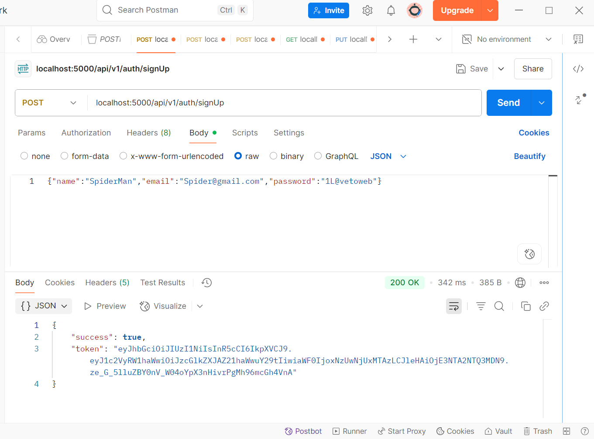

# vibe-project
Take home assignment ( Vibe check)

<h1> Assignment 2: The User Era (Medium) </h1>

<h3>New Project Structure:<h3>

<h3> Database Connection: </h3>

<h3> User Signup: </h3>

<h3> User Login </h3>

<h3>Protected Route - Posting a Vibe:</h3>

<h4> without token </h4>

<h4> With Token </h4>

<h3> Populated Get All Vibes Endpoint: </h3>

<h1>Assignment 3: The Social Experience (Hard) </h1>

<h3>Like/Unlike Functionality:</h3>

<h4> Like </h4>

<h4> dislike </h4>

<h3>Comments Functionality:</h3>

<h3> Follow & Personalized Feed: </h3>

<h3>Authorization (Security Check):</h3>

<h3> Pagination </h3>

<h1>---- THe End, Implemented all features -----</h1>