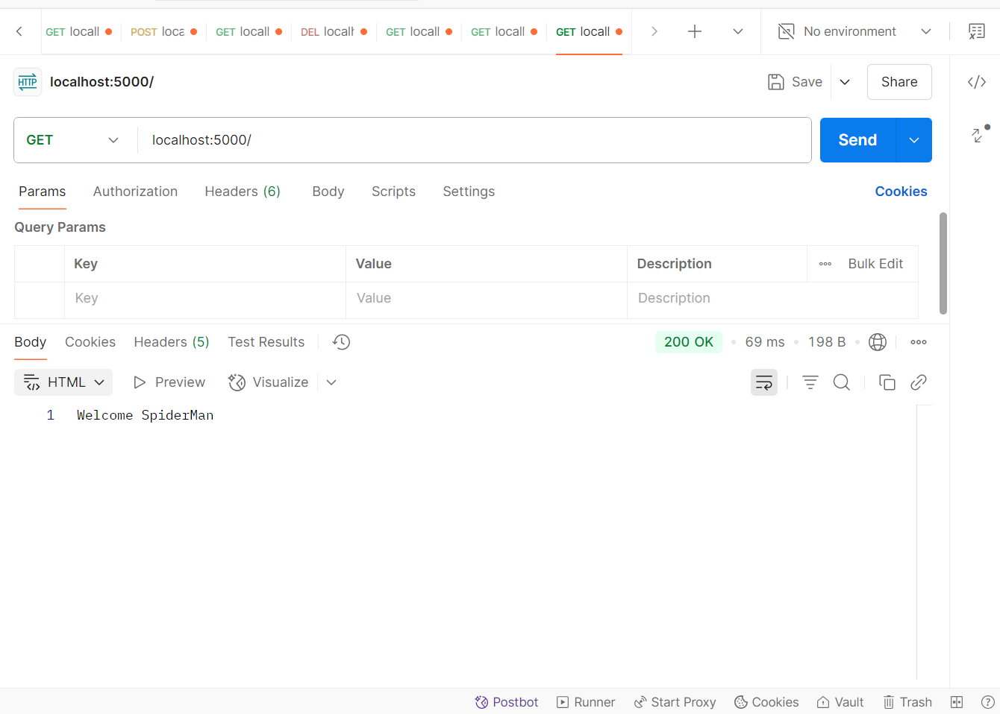
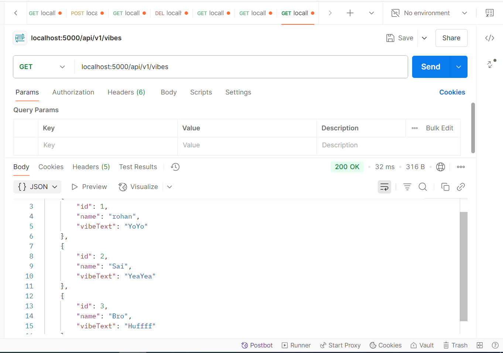
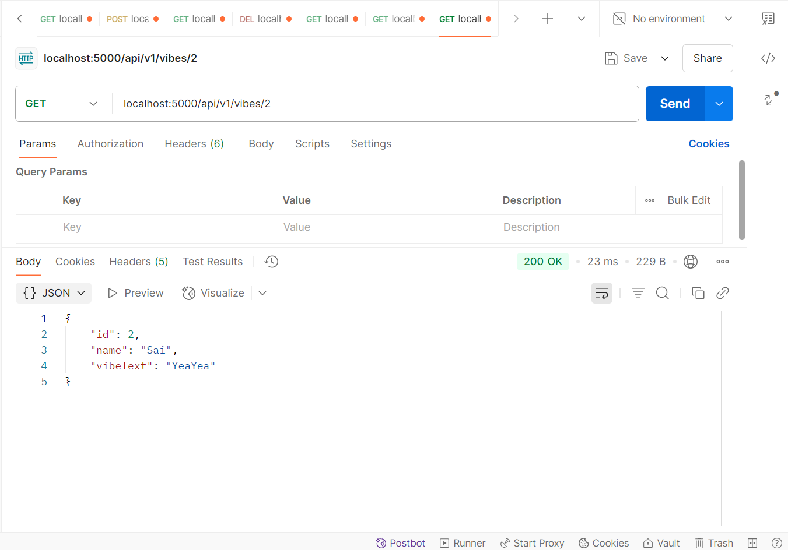
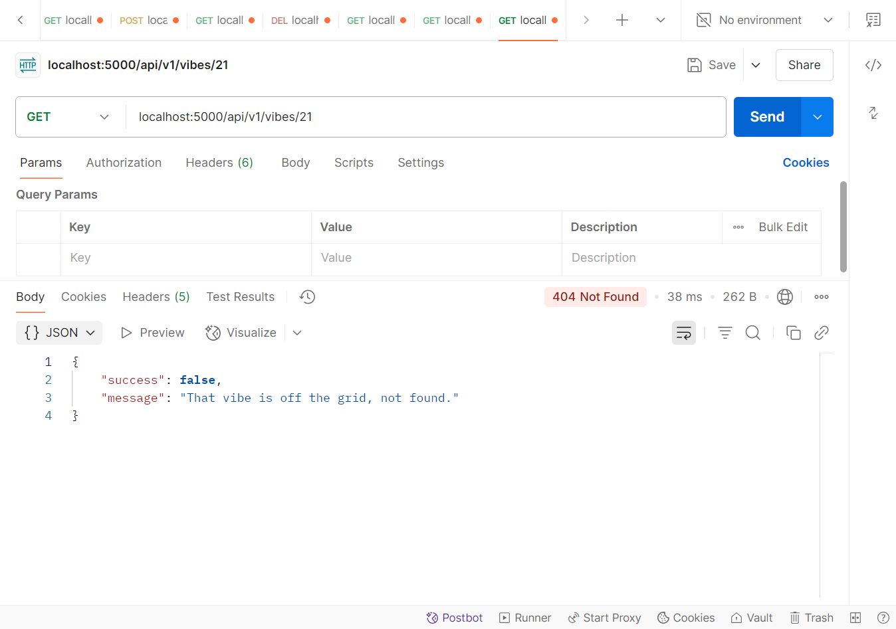

# vibecheck-api

<h1> Easy Assignment </h1>

<h3>Root Endpoint:</h3>

<h3>Get All Vibes Endpoint:</h3>

<h3>Get Single Vibe Endpoint (Success Case):</h3>

<h3>Get Single Vibe Endpoint (Failure Case):</h3>

